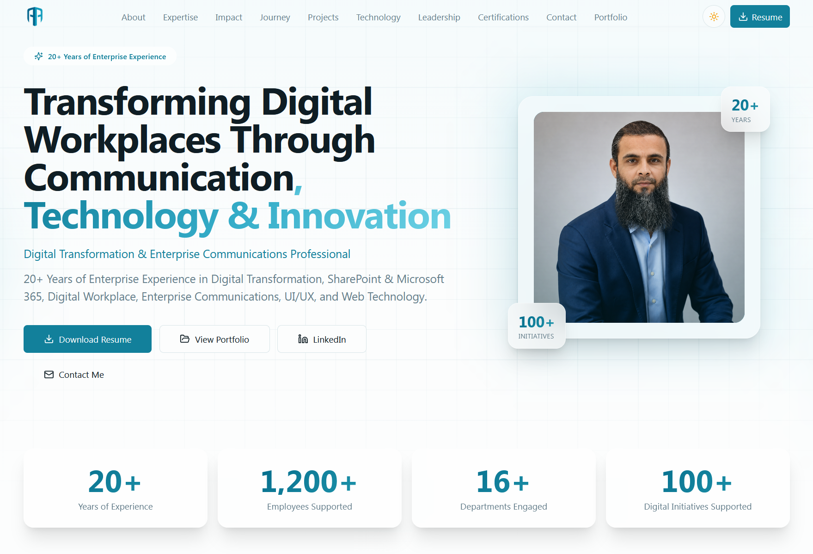

<div align="center">

# Azad Abdul Hameed Balushi

### Digital Transformation & Enterprise Communications Professional

<p>
  <em>Bridging Business, Communication, Technology, and Innovation to Deliver
  Meaningful Digital Transformation and Exceptional Employee Experiences.</em>
</p>

---



---

[](https://azadbalushi.pages.dev)
[](https://www.linkedin.com/in/azadbalushi/)
[](https://nextjs.org)
[](https://www.typescriptlang.org)
[](https://tailwindcss.com)
[](https://resend.com)

</div>

---

## Overview

This repository contains the source code for the personal portfolio website of **Azad Abdul Hameed Balushi**, a senior Digital Transformation, SharePoint, Microsoft 365, Digital Workplace, Enterprise Communications, UI/UX, and Web Technology professional with **20+ years** of enterprise experience.

The website is a production-ready executive portfolio built with **Next.js**, **React**, **TypeScript**, **Tailwind CSS**, and **Framer Motion**. It positions Azad as a highly experienced professional seeking leadership and specialist opportunities, targeting recruiters, hiring managers, and leadership teams.

---

## About Me

Azad Abdul Hameed Balushi is a strategic professional with more than two decades of experience delivering digital transformation initiatives across large enterprise environments. His career spans:

- **SABIC Digital Transformation** contributions — leading SharePoint and Microsoft 365 platform strategies
- **Enterprise Communications** — internal communication frameworks connecting leadership vision with every layer of the organization
- **Digital Workplace Solutions** — integrated environments unifying collaboration, content, and productivity
- **Employee Experience** programs — journey mapping and engagement initiatives serving 1,200+ employees across 16+ departments
- **Knowledge Management** — taxonomy, content lifecycle, and knowledge-sharing systems
- **Power Platform** — low-code automation, apps, and dashboards
- **UI/UX Strategy** — design systems and experience principles
- **Web Technologies** — front-end development across modern frameworks and CMS platforms
- **AI & Innovation** — generative AI exploration and emerging-technology pilots

> Bridging Business, Technology and Communication to Deliver Meaningful Digital Transformation and Lasting Organizational Impact.

---

## Key Features

| Feature | Description |
|---|---|
| **Premium Executive Design** | Enterprise-grade aesthetic with glassmorphism effects and teal brand palette |
| **Dark & Light Mode** | Full theme toggle with smooth transitions and system preference detection |
| **Animated Metrics** | Counters animate on scroll into view (20+ years, 1200+ employees, 16+ departments, 100+ initiatives) |
| **Sticky Navigation** | Glassmorphism navbar with scroll-spy active section highlighting |
| **Executive Impact Dashboard** | 8 impact cards each showing Challenge, Solution, Outcome, and Business Value |
| **Animated Career Timeline** | Alternating timeline with 7 roles, achievements, technologies, and business impact |
| **Case-Study Projects** | Interactive project selector with full case-study layouts and impact metrics |
| **Technology Ecosystem** | 20 technologies grouped by category with professional icons in teal boxes |
| **Testimonials Carousel** | Auto-rotating testimonials with manual controls |
| **Functional Contact Form** | Production-ready form with Resend email delivery, validation, and spam protection |
| **Full Favicon Support** | Browser tabs, bookmarks, mobile devices, and app icons using AB_Logo.png |
| **Fully Responsive** | Optimized for desktop, tablet, and mobile |
| **SEO Optimized** | Metadata, Open Graph, and semantic HTML |
| **Single Source of Truth** | All personal data centralized in `config/profile.ts` for easy maintenance |
| **Portfolio Hub** | Dedicated `/portfolio` page with folder-driven gallery, category filters, and banner hero slider |
| **Advanced Portfolio Viewer** | Full-featured lightbox with zoom, pan, pinch, fullscreen, download, mini-navigator, and keyboard shortcuts |
| **PWA Support** | Installable app with offline support, service worker, manifest, and splash screens |

---

## Technology Stack

| Category | Technologies |
|---|---|
| **Framework** | Next.js 13.5, React 18 |
| **Language** | TypeScript 5.2 |
| **Styling** | Tailwind CSS 3.3, tailwindcss-animate |
| **Animation** | Framer Motion |
| **UI Components** | shadcn/ui, Radix UI primitives, Lucide React icons |
| **Theming** | next-themes (dark/light mode) |
| **Notifications** | Sonner |
| **Email Delivery** | Resend API (optional — static export uses mailto fallback) |
| **Deployment** | GitHub Pages / Cloudflare Pages / Netlify / Vercel (static export) |

---

## Core Expertise

| | | | |
|---|---|---|---|
| Digital Transformation | Enterprise Communications | SharePoint & Microsoft 365 | Digital Workplace Solutions |
| Employee Experience | Knowledge Management | Power Platform | Executive Communications |
| UI/UX Strategy | Web Technologies | Data Analytics & Power BI | AI & Innovation |
| Business Engagement | Change Adoption | | |

---

## Project Structure

```
├── app/
│   ├── globals.css              # Global styles, theme variables, glassmorphism utilities
│   ├── layout.tsx               # Root layout with fonts, theme provider, SEO metadata, favicon
│   ├── page.tsx                 # Main page assembling all sections
│   ├── robots.ts                # Auto-generated robots.txt
│   ├── sitemap.ts               # Auto-generated sitemap.xml
│   ├── api/
│   │   └── contact/
│   │       └── route.ts          # Resend email API route for contact form
│   └── portfolio/
│       ├── layout.tsx           # Portfolio layout with structured data
│       └── page.tsx             # Portfolio hub page with category filters
│
├── components/
│   ├── navbar.tsx               # Sticky glassmorphism navigation with scroll-spy
│   ├── theme-provider.tsx       # Dark/light theme provider wrapper
│   ├── theme-toggle.tsx         # Animated theme toggle button
│   ├── sonner-toaster.tsx       # Toast notification provider
│   ├── section-utils.tsx        # AnimatedCounter, Reveal, SectionHeading helpers
│   ├── sections/
│   │   ├── hero.tsx             # Hero with headline, profile, animated metrics
│   │   ├── about.tsx            # Executive biography and focus areas
│   │   ├── expertise.tsx        # 14 core expertise cards
│   │   ├── impact.tsx           # Executive impact dashboard (8 cards)
│   │   ├── career.tsx           # Animated career timeline (7 roles)
│   │   ├── projects.tsx         # Featured project case studies
│   │   ├── technology.tsx       # Technology ecosystem with icons
│   │   ├── leadership.tsx       # Leadership & collaboration capabilities
│   │   ├── certifications.tsx   # Professional credentials
│   │   ├── testimonials.tsx     # Auto-rotating testimonials carousel
│   │   ├── contact.tsx          # Contact form with Resend integration
│   │   └── footer.tsx           # Footer with links and contact
│   ├── portfolio/
│   │   ├── portfolio-hero.tsx   # Banner hero slider with auto-rotation
│   │   ├── portfolio-gallery.tsx # Grid gallery with lightbox trigger
│   │   ├── portfolio-lightbox.tsx # Advanced viewer with zoom, pan, fullscreen
│   │   └── project-card.tsx     # Project card component (for data-driven mode)
│   ├── pwa/
│   │   ├── install-prompt.tsx   # Install banner for Android/desktop
│   │   ├── ios-install-modal.tsx # iOS installation instructions modal
│   │   ├── splash-screens.tsx   # iOS splash screen link tags
│   │   └── sw-register.tsx      # Service worker registration (production only)
│   ├── seo/
│   │   ├── structured-data.tsx       # JSON-LD Person + WebSite schema
│   │   └── portfolio-structured-data.tsx # JSON-LD ProfilePage + CollectionPage schema
│   └── ui/                      # shadcn/ui component library
│
├── config/
│   ├── profile.ts               # Single source of truth for all personal data
│   ├── seo.ts                   # Centralized SEO config, Open Graph, structured data
│   ├── portfolio-data.ts        # Data-driven project definitions (optional mode)
│   ├── portfolio-titles.ts      # Optional title & category label overrides
│   └── portfolio-generated.ts   # AUTO-GENERATED — folder-driven portfolio manifest
│
├── lib/
│   ├── icons.ts                 # Dynamic icon resolver
│   └── utils.ts                 # cn() class merge utility
│
├── scripts/
│   ├── generate-portfolio-manifest.mjs # Folder-driven manifest generator
│   └── generate-splash-screens.mjs     # iOS PWA splash screen generator
│
├── public/
│   ├── AB_Logo.png              # Personal logo (favicon + navbar)
│   ├── azad-portrait.png        # Profile photo
│   ├── profile-photo.jpg        # Fallback profile photo
│   ├── site.webmanifest         # PWA manifest for mobile/app icons
│   ├── sw.js                    # Service worker (caching, offline support)
│   ├── offline.html             # Offline fallback page
│   ├── resume.pdf               # Downloadable resume
│   ├── icons/                   # PWA app icons (192px, 512px, maskable, apple-touch)
│   ├── splash/                  # iOS PWA splash screens (16 device sizes)
│   └── portfolio/               # Folder-driven portfolio images
│       ├── 3d-artwork/          # Each folder = one category
│       ├── branding/
│       ├── digital-transformation/
│       ├── multimedia/
│       ├── photography/
│       ├── sharepoint-development/
│       ├── ui-ux/
│       ├── web-design/
│       └── placeholders/        # Placeholder SVGs (excluded from generation)
│
├── static-portfolio/            # Standalone static HTML portfolio (no build step)
├── tailwind.config.ts           # Tailwind config with brand color palette
├── next.config.js               # Next.js configuration
└── package.json                 # Dependencies and scripts
```

> **Maintainability:** All personal information (name, title, email, LinkedIn URL, resume URL, profile photo, metrics, expertise, career history, projects, testimonials, and certifications) is stored in `config/profile.ts`. To update the website, edit only that file.

---

## Architecture Overview

The project is composed of seven interconnected layers, each responsible for a distinct concern:

```
┌─────────────────────────────────────────────────────────────────┐
│                     BROWSER (Client)                            │
│                                                                 │
│  ┌──────────┐  ┌──────────┐  ┌──────────┐  ┌──────────────┐   │
│  │ Homepage │  │ Portfolio│  │ SEO Meta │  │ PWA Shell    │   │
│  │ Sections │  │ Hub Page │  │ & JSON-LD│  │ (SW + Manifest)│  │
│  └────┬─────┘  └────┬─────┘  └────┬─────┘  └──────┬───────┘   │
│       │              │              │               │           │
│       │         ┌────┴─────────────────┐          │           │
│       │         │  Portfolio Gallery   │          │           │
│       │         │  + Hero Slider       │          │           │
│       │         │  + Advanced Lightbox │          │           │
│       │         └────┬─────────────────┘          │           │
│       │              │                            │           │
└───────┼──────────────┼────────────────────────────┼───────────┘
        │              │                            │
        │     reads    │ reads                      │ caches
        │     from     │ from                       │ assets
        │              │                            │
┌───────┴──────────────┴────────────────────────────┴───────────┐
│                    BUILD-TIME LAYER                            │
│                                                                 │
│  ┌─────────────┐  ┌──────────────────────┐  ┌──────────────┐  │
│  │config/      │  │scripts/              │  │config/       │  │
│  │profile.ts   │  │generate-portfolio-   │  │seo.ts        │  │
│  │(personal    │  │manifest.mjs          │  │(SEO config,  │  │
│  │ data)       │  │(scans public/        │  │ structured   │  │
│  │             │  │ portfolio/ folders)  │  │ data, OG)    │  │
│  └──────┬──────┘  └──────────┬───────────┘  └──────┬───────┘  │
│         │                    │                      │          │
│         │           generates │           generates  │          │
│         │                    ▼                      ▼          │
│         │          ┌──────────────────┐   ┌──────────────┐    │
│         │          │config/           │   │app/robots.ts │    │
│         │          │portfolio-        │   │app/sitemap.ts│    │
│         │          │generated.ts      │   │JSON-LD       │    │
│         │          │(manifest)        │   │scripts       │    │
│         │          └──────────────────┘   └──────────────┘    │
│         │                                                      │
│         │     ┌──────────────────────────────────┐            │
│         └────►│   Next.js Build / Static Export  │◄──────────┘
│               │   (next build → out/)            │
│               └──────────────┬───────────────────┘
│                              │
└──────────────────────────────┼───────────────────────────────┘
                               │
                ┌──────────────┴───────────────┐
                │                              │
        ┌───────▼───────┐              ┌───────▼───────┐
        │   DYNAMIC     │              │   STATIC      │
        │   DEPLOYMENT  │              │   DEPLOYMENT  │
        │               │              │               │
        │ Cloudflare    │              │ GitHub Pages  │
        │ Pages (with   │              │ Netlify       │
        │ Next.js       │              │ (static out/) │
        │ runtime)      │              │               │
        │               │              │ Uses          │
        │ Uses Resend   │              │ mailto:       │
        │ API route for │              │ fallback for  │
        │ contact form  │              │ contact form  │
        └───────────────┘              └───────────────┘
```

### Layer Responsibilities

| Layer | Responsibility | Key Files |
|---|---|---|
| **Homepage** | Executive portfolio sections (hero, about, expertise, impact, career, projects, technology, leadership, certifications, testimonials, contact) | `app/page.tsx`, `components/sections/*` |
| **Portfolio Hub** | Folder-driven gallery page with category filters and banner hero slider | `app/portfolio/page.tsx`, `components/portfolio/*` |
| **Advanced Portfolio Viewer** | Full-featured lightbox with zoom, pan, pinch, fullscreen, download, and keyboard navigation | `components/portfolio/portfolio-lightbox.tsx` |
| **SEO Layer** | Centralized metadata, Open Graph, Twitter Cards, JSON-LD structured data, sitemap, robots.txt | `config/seo.ts`, `app/robots.ts`, `app/sitemap.ts`, `components/seo/*` |
| **PWA Layer** | Installable app with offline support, service worker caching, manifest, splash screens, and install prompts | `public/sw.js`, `public/site.webmanifest`, `components/pwa/*` |
| **Dynamic Deployment** | Cloudflare Pages with Next.js runtime — enables Resend API route for server-side email delivery | `app/api/contact/route.ts` |
| **Static Deployment** | GitHub Pages / Netlify — fully static `out/` directory with `mailto:` fallback for the contact form | `static-portfolio/`, `netlify.toml` |

---

## Portfolio Hub Architecture

The portfolio hub uses a **folder-driven architecture** — no manual data entry is required. The system automatically discovers images, generates categories, builds galleries, and creates SEO metadata by scanning the `public/portfolio/` directory.

### How It Works

```
public/portfolio/
├── digital-transformation/          ← Each folder becomes a CATEGORY
│   ├── digital-workplace-hub.svg    ← Each image becomes a PORTFOLIO ITEM
│   ├── digital-workplace-hub-banner.svg  ← Banner image (excluded from gallery)
│   ├── executive-communications.svg
│   ├── executive-communications-banner.svg
│   └── power-platform-automation.svg
├── sharepoint-development/          ← Another category
│   ├── enterprise-intranet.svg
│   ├── enterprise-intranet-banner.svg
│   └── ...
└── ui-ux/                           ← Category label auto-generated as "UI / UX"
    ├── intranet-ux-design-system.svg
    └── intranet-ux-design-system-banner.svg
```

### Automatic Generation

When you run `npm run dev` or `npm run build`, the pre-build script `scripts/generate-portfolio-manifest.mjs` executes and automatically:

| Task | How |
|---|---|
| **Generates categories** | Each subfolder in `public/portfolio/` becomes a category tab |
| **Generates gallery items** | Each image file becomes a portfolio card in the gallery |
| **Generates captions** | Filenames are converted to human-readable titles (e.g., `power-bi-dashboard.jpg` → "Power BI Dashboard") |
| **Generates alt text** | SEO-friendly alt text is derived from the filename and category (e.g., "Power BI Dashboard — Digital Transformation portfolio piece by Azad Balushi") |
| **Generates image SEO** | All captions, alt text, and category labels feed into the portfolio page's structured data |
| **Generates portfolio metadata** | A complete TypeScript manifest is written to `config/portfolio-generated.ts` with all items, categories, banners, and galleries |

### Smart Filename Processing

The generator includes intelligent word handling:

| Input | Output | Reason |
|---|---|---|
| `sabic.png` | `Sabic` | Standard title case |
| `power-bi-dashboard.jpg` | `Power BI Dashboard` | "Power BI" is a recognized mixed-case term |
| `sharepoint-forms.png` | `SharePoint Forms` | "SharePoint" is a recognized mixed-case term |
| `m365-adoption.svg` | `M365 Adoption` | "M365" is a recognized abbreviation |
| `3d-renders.png` | `3D Renders` | "3D" is a recognized mixed-case term |
| `ai-innovation.jpg` | `AI Innovation` | "AI" is a recognized abbreviation |
| `ui-ux` (folder) | `UI / UX` | Special label override for this slug |

### Multi-Image Galleries

A single project can have multiple gallery images by using numbered suffixes:

```
public/portfolio/digital-transformation/
├── intranet-redesign.png        ← Main image (thumbnail)
├── intranet-redesign-1.png      ← Gallery image 1
├── intranet-redesign-2.png      ← Gallery image 2
├── intranet-redesign-3.png      ← Gallery image 3
└── intranet-redesign-banner.svg ← Banner (excluded from gallery)
```

All numbered images are grouped under the base name `intranet-redesign` and appear as a multi-image gallery in the lightbox.

### The Manifest Generator

**File:** `scripts/generate-portfolio-manifest.mjs`

This Node.js script runs automatically before every `dev` and `build` command (via the `predev` and `prebuild` hooks in `package.json`). It:

1. Scans `public/portfolio/` for category subfolders
2. Excludes the `placeholders/` folder and any hidden folders
3. Separates banner images from gallery images
4. Groups gallery images by project base name
5. Generates captions, alt text, and IDs from filenames
6. Applies optional title overrides from `config/portfolio-titles.ts`
7. Writes the complete manifest to `config/portfolio-generated.ts`

### The Generated Manifest

**File:** `config/portfolio-generated.ts`

> **Important:** This file is **AUTO-GENERATED** and should **never be edited manually**. It is regenerated every time you run `npm run dev` or `npm run build`. To change portfolio content, add or remove images in `public/portfolio/` and optionally add overrides in `config/portfolio-titles.ts`.

The manifest exports a `portfolioManifest` object containing:

| Property | Type | Description |
|---|---|---|
| `categories` | `PortfolioCategory[]` | One entry per folder, with `id`, `label`, and `count` |
| `items` | `PortfolioItem[]` | One entry per project, with `src`, `caption`, `alt`, `category`, `categoryLabel`, and `gallery` |
| `banners` | `PortfolioBanner[]` | One entry per banner image, used by the hero slider |

---

## Portfolio Hero Slider

The portfolio page features a full-width **banner hero slider** that auto-rotates through featured project banners.

### Banner Detection System

The manifest generator automatically detects banner images using a naming convention:

| Filename Pattern | Detected as Banner? | Example |
|---|---|---|
| `project-banner.jpg` | Yes | `enterprise-intranet-banner.svg` |
| `project-1-banner.jpg` | Yes | `intranet-redesign-1-banner.svg` |
| `project.jpg` | No (gallery image) | `enterprise-intranet.svg` |
| `project-1.jpg` | No (gallery image) | `intranet-redesign-1.png` |

### Banner Naming Convention

To add a banner to the hero slider, name your image with a `-banner` suffix:

```
public/portfolio/digital-transformation/
├── digital-workplace-hub.svg              ← Gallery image
└── digital-workplace-hub-banner.svg       ← Banner image (appears in hero slider)
```

### How Banners Are Processed

| Rule | Behavior |
|---|---|
| **Banner images appear in the slider** | Each banner becomes a slide in the portfolio hero slider with auto-rotation |
| **Banner images are excluded from the gallery** | Banners are never shown as gallery cards — they only appear in the hero |
| **Banner captions are generated automatically** | The `-banner` suffix is stripped and the remaining name is converted to a title |
| **Banner alt text is generated automatically** | SEO-friendly alt text includes the project name and category |
| **Banner category labels are included** | Each banner carries its category label for the slider overlay |

### Hero Slider Features

| Feature | Description |
|---|---|
| **Auto-rotation** | Slides advance every 6 seconds |
| **Pause on hover** | Auto-rotation pauses when the mouse is over the slider |
| **Swipe navigation** | Touch swipe support on mobile devices |
| **Arrow controls** | Left/right navigation arrows on desktop |
| **Dot indicators** | Clickable dots showing current slide position |
| **Slide counter** | Current slide / total slides indicator |
| **Category badge** | Each slide displays its category label |
| **Caption overlay** | Project title appears with a gradient overlay for readability |

---

## Advanced Portfolio Viewer

The portfolio includes a production-grade **lightbox / image viewer** (`components/portfolio/portfolio-lightbox.tsx`) designed for viewing high-resolution portfolio work, long screenshots, dashboards, and detailed UI/UX designs.

### Features

| Feature | Description |
|---|---|
| **Zoom In / Zoom Out** | Discrete zoom levels (1x, 1.5x, 2x, 3x, 4x) via toolbar buttons |
| **Mouse Wheel Zoom** | Smooth continuous zoom by scrolling the mouse wheel |
| **Double-Click Zoom** | Double-click toggles between fit-to-screen and 2x zoom |
| **Double-Tap Zoom** | Double-tap on mobile toggles between fit-to-screen and 2x zoom |
| **Pinch Zoom** | Two-finger pinch to zoom continuously on touch devices (0.2x–8x range) |
| **Pan & Drag** | Click-and-drag (desktop) or touch-and-drag (mobile) to pan when zoomed in; panning is constrained to image bounds |
| **Fullscreen Mode** | Native browser fullscreen API support with automatic fit recalculation |
| **Download Original Image** | Downloads the original full-resolution image file |
| **Zoom Percentage Indicator** | Shows current zoom level as a percentage (e.g., 100%, 150%, 200%) |
| **Fit to Screen** | Scales the image to fit entirely within the viewport |
| **Fit Width** | Scales the image to fill the viewport width (ideal for tall screenshots) |
| **Actual Size** | Displays the image at its native pixel dimensions (1:1) |
| **Mini Navigator** | A small thumbnail preview with a viewport indicator rectangle, shown for tall images or when zoomed in — helps users orient themselves within large images |
| **Image Information Panel** | Toggleable side panel showing project title, category, image dimensions, and current zoom level |
| **Keyboard Navigation** | Full keyboard shortcut support (see below) |
| **Mobile Gesture Support** | Swipe left/right to navigate, pinch to zoom, double-tap to zoom, drag to pan |
| **Long Screenshot Optimization** | Automatic fit-width detection and mini-navigator activation for tall images |
| **Reset View** | Returns to fit-to-screen with centered position |

### Keyboard Shortcuts

| Key | Action |
|---|---|
| `ESC` | Close lightbox (or exit fullscreen if active) |
| `←` (Left Arrow) | Previous image |
| `→` (Right Arrow) | Next image |
| `+` or `=` | Zoom in |
| `-` | Zoom out |
| `0` | Reset view to fit-to-screen |

### Supported Use Cases

The advanced viewer is optimized for:

| Use Case | Why It Matters |
|---|---|
| **Long website screenshots** | Fit-width mode + mini-navigator allow users to scroll through full-page captures |
| **SharePoint portals** | Detailed intranet screenshots can be zoomed to read text and inspect layout |
| **Dashboards** | Power BI and analytics dashboards can be inspected at full resolution |
| **UI/UX designs** | Design system screens and wireframes can be zoomed for detail review |
| **Photography** | High-resolution industrial and corporate photography displays at native quality |
| **Branding projects** | Logo sheets and brand guidelines can be examined pixel-by-pixel |
| **High-resolution portfolio work** | Any large image benefits from zoom, pan, and download capabilities |

---

## Portfolio Title Override System

While the folder-driven system automatically generates titles from filenames, some names require manual correction for proper branding, acronyms, and professional terminology. The override system provides this without replacing the automation.

### Configuration File

**File:** `config/portfolio-titles.ts`

This is the **only** file to edit when you need to correct an auto-generated title. It exports two maps:

```typescript
// Project title overrides — key is the lowercased image base name
export const projectTitleOverrides: Record<string, string> = {
  "sabic": "SABIC",
  "it-readiness": "IT Readiness",
  "power-bi-dashboard": "Power BI Dashboard",
  "sharepoint-forms": "SharePoint Forms",
  "sabic-digital-transformation-online": "SABIC Digital Transformation Online",
};

// Category label overrides — key is the lowercased folder name
export const categoryLabelOverrides: Record<string, string> = {
  "ui-ux": "UI / UX",
  "sharepoint-development": "SharePoint Development",
  "microsoft-365": "Microsoft 365",
  "power-bi-dashboard": "Power BI Dashboard",
};
```

### How to Find the Override Key

| Step | Example |
|---|---|
| 1. Take the image filename | `sabic-digital-transformation-online.svg` |
| 2. Remove the file extension | `sabic-digital-transformation-online` |
| 3. Strip any trailing `-banner` or `-<number>` suffix | `sabic-digital-transformation-online` |
| 4. Lowercase it | `sabic-digital-transformation-online` |
| 5. Use as the key in `projectTitleOverrides` | `"sabic-digital-transformation-online": "SABIC Digital Transformation Online"` |

For categories, use the folder name directly:

| Folder | Key | Override |
|---|---|---|
| `ui-ux/` | `"ui-ux"` | `"UI / UX"` |
| `sharepoint-development/` | `"sharepoint-development"` | `"SharePoint Development"` |

### What Overrides Affect

When an override is present, the custom title is used **everywhere** — ensuring consistent branding:

| Surface | Affected? |
|---|---|
| Portfolio gallery cards | Yes — card title shows the override |
| Hero banner slider | Yes — slider caption shows the override |
| Lightbox title | Yes — lightbox header shows the override |
| Image captions | Yes — caption field uses the override |
| Alt text | Yes — alt text incorporates the override |
| SEO metadata | Yes — structured data and meta use the override |

### When No Override Exists

If a project or category is **not** listed in `config/portfolio-titles.ts`, the existing automatic filename-to-title generation continues to work exactly as before. Most portfolio items will never need an override.

### Common Override Examples

| Auto-Generated | Override Key | Override Value | Reason |
|---|---|---|---|
| `Sabic` | `"sabic"` | `"SABIC"` | Brand name is an acronym |
| `It Readiness` | `"it-readiness"` | `"IT Readiness"` | "IT" is an abbreviation |
| `Ui Ux` | `"ui-ux"` (category) | `"UI / UX"` | Standard industry formatting |
| `Power Bi Dashboard` | `"power-bi-dashboard"` | `"Power BI Dashboard"` | "Power BI" is a product name |
| `Sharepoint` | `"sharepoint"` | `"SharePoint"` | CamelCase brand name |
| `Microsoft 365` | `"microsoft-365"` (category) | `"Microsoft 365"` | Product name |
| `Ai` | `"ai"` | `"AI"` | Acronym |
| `DigiVerse` | `"digiverse"` | `"DigiVerse"` | Brand-specific naming |

---

## Progressive Web Application (PWA)

The portfolio is a fully installable **Progressive Web App** — visitors can install it on their device for an app-like experience with offline support.

### PWA Components

| Component | File | Purpose |
|---|---|---|
| **Web App Manifest** | `public/site.webmanifest` | App name, icons, theme color, display mode, start URL, shortcuts |
| **Service Worker** | `public/sw.js` | Caching strategies for offline access (static assets, pages, images) |
| **SW Registration** | `components/pwa/sw-register.tsx` | Registers the service worker in production only (unregisters in dev) |
| **Install Prompt** | `components/pwa/install-prompt.tsx` | Install banner for Android/desktop browsers |
| **iOS Install Modal** | `components/pwa/ios-install-modal.tsx` | Step-by-step instructions for iOS (no native prompt API) |
| **Splash Screens** | `components/pwa/splash-screens.tsx` | 16 iOS device-specific splash screen link tags |
| **App Icons** | `public/icons/` | 192px, 512px, maskable, apple-touch icon, favicon |
| **Offline Page** | `public/offline.html` | Branded offline fallback with "Try Again" button |

### Service Worker Caching Strategy

| Request Type | Strategy | Cache |
|---|---|---|
| **Navigations** | Network-first with cache fallback | `pages` cache |
| **Static assets** (JS, CSS, fonts) | Cache-first | `static` cache |
| **Images** | Stale-while-revalidate | `images` cache |
| **Other** | Stale-while-revalidate | `pages` cache |

> **Development note:** The service worker is only registered in production (`NODE_ENV === 'production'`). In development, any stale service worker is actively unregistered to prevent caching conflicts with the dev server's hot-reloading.

### Installation Instructions

#### Android (Chrome)

1. Open the website in Chrome
2. Tap the **Install** chip in the navbar, or tap the menu (⋮) and select **Install app**
3. Confirm the installation prompt
4. The app appears on your home screen and in the app drawer

#### iPhone / iPad (Safari)

1. Open the website in Safari
2. Tap the **Share** button (square with up arrow)
3. Scroll and select **Add to Home Screen**
4. Tap **Add** to confirm
5. The app appears on your home screen with the AB logo

> **Note:** iOS does not support the standard `beforeinstallprompt` event. The portfolio detects iOS devices and shows a modal with step-by-step instructions instead.

#### Desktop (Chrome / Edge)

1. Open the website in Chrome or Edge
2. Click the **Install** icon in the address bar, or click the **Install** chip in the navbar
3. Confirm the installation prompt
4. The app opens in a standalone window and appears in your OS app list

### PWA Benefits

| Benefit | Description |
|---|---|
| **Offline access** | Previously visited pages and assets are available without a network connection |
| **App-like experience** | Standalone display mode with no browser chrome |
| **Home screen icon** | Custom AB logo icon on the device |
| **Splash screen** | Branded splash screen on launch (iOS) |
| **Faster loading** | Cached assets load instantly on repeat visits |
| **Push notifications ready** | Service worker infrastructure is in place for future notification support |

### PWA Limitations

| Limitation | Detail |
|---|---|
| **iOS Safari only** | iOS PWA features work best in Safari; Chrome on iOS uses WKWebView and does not support install prompts |
| **No background sync** | The service worker does not currently implement background sync |
| **No push notifications** | Push notification support is not configured but the infrastructure exists |
| **Cache versioning** | Cache version must be incremented in `sw.js` when making significant changes to force cache refresh |

---

## Repository Branching Strategy

The repository uses a multi-branch strategy to support both **real portfolio images** and **dummy/placeholder images** across two deployment targets.

### Branch Overview

```
                    ┌─────────────────────────────────────────┐
                    │            REPOSITORY                   │
                    │                                         │
                    │  main ◄─────────────────────────────    │
                    │  ├── Real portfolio images             │
                    │  ├── Cloudflare Dynamic Deployment      │
                    │  └── Production source of truth         │
                    │                                         │
                    │  real-github ◄──────────────────────    │
                    │  ├── Real portfolio images             │
                    │  └── GitHub Pages Static Deployment     │
                    │                                         │
                    │  dummy-cloudflare ◄─────────────────    │
                    │  ├── Dummy portfolio images            │
                    │  └── Cloudflare Dynamic Deployment      │
                    │                                         │
                    │  dummy-github ◄──────────────────────   │
                    │  ├── Dummy portfolio images            │
                    │  └── GitHub Pages Static Deployment     │
                    │                                         │
                    └─────────────────────────────────────────┘
```

### Branch Details

| Branch | Portfolio Images | Deployment Target | Purpose |
|---|---|---|---|
| **`main`** | Real images | Cloudflare Pages (dynamic) | Production source of truth — full Next.js runtime with Resend API route for contact form email delivery |
| **`real-github`** | Real images | GitHub Pages (static) | Static export with `mailto:` fallback for the contact form — deployable to GitHub Pages |
| **`dummy-cloudflare`** | Dummy/placeholder images | Cloudflare Pages (dynamic) | Development and testing branch with placeholder images — safe for public demos and sharing |
| **`dummy-github`** | Dummy/placeholder images | GitHub Pages (static) | Static export with placeholder images — safe for public demos on GitHub Pages |

### When to Use Each Branch

| Scenario | Branch |
|---|---|
| **Production deployment** | `main` → Cloudflare Pages |
| **Static production deployment** | `real-github` → GitHub Pages |
| **Public demo / sharing** | `dummy-cloudflare` or `dummy-github` |
| **Development with real images** | `main` (local dev) |
| **Development with dummy images** | `dummy-cloudflare` (local dev) |

### Deployment Configuration per Branch

| Setting | Dynamic Branches | Static Branches |
|---|---|---|
| `output: 'export'` in `next.config.js` | Commented out | Enabled |
| Contact form | Resend API route (`/api/contact`) | `mailto:` fallback |
| Server runtime | Required (Cloudflare Pages with Next.js) | Not required (static `out/`) |
| SEO | Full structured data + sitemap | Full structured data + sitemap |
| PWA | Full support | Full support |
| Portfolio hub | Full support | Full support |

---

## SEO Architecture

The project includes a comprehensive, centralized SEO system.

### Centralized Configuration

**File:** `config/seo.ts` — the single source of truth for all SEO settings:

| Feature | Description |
|---|---|
| **Site metadata** | Title, description, keywords, author, canonical URL |
| **Page-level SEO** | Per-page title, description, keywords, and canonical URL overrides |
| **Open Graph** | Social sharing cards for Facebook, LinkedIn, etc. |
| **Twitter Cards** | Summary large image cards for Twitter/X |
| **Structured data** | JSON-LD Person, WebSite, ProfilePage, and CollectionPage schemas |
| **Helper functions** | `buildMetadata()` and `canonicalUrl()` for consistent metadata across pages |

### Auto-Generated SEO Files

| File | Purpose |
|---|---|
| `app/robots.ts` | Generates `robots.txt` with allow-all rules and sitemap reference |
| `app/sitemap.ts` | Generates `sitemap.xml` with all page routes and priorities |
| `components/seo/structured-data.tsx` | Renders JSON-LD `Person` and `WebSite` schema on the homepage |
| `components/seo/portfolio-structured-data.tsx` | Renders JSON-LD `ProfilePage` and `CollectionPage` schema on the portfolio page |

### Structured Data Types

| Schema | Where | Purpose |
|---|---|---|
| `Person` | Homepage | Identifies Azad as a professional entity with job title, skills, and employer |
| `WebSite` | Root layout | Site-level metadata with search action |
| `ProfilePage` | Portfolio page | Identifies the portfolio as a profile page |
| `CollectionPage` | Portfolio page | Identifies the portfolio as a collection of creative works |

---

## Local Development

### Prerequisites

- **Node.js** 18.17 or higher
- **npm** 9.x or higher

### Setup

```bash
# Clone the repository
git clone https://github.com/your-username/azad-balushi-portfolio.git
cd azad-balushi-portfolio

# Install dependencies
npm install

# Start the development server
npm run dev
```

The development server will start at `http://localhost:3000`.

> **Note:** The `predev` hook automatically runs the portfolio manifest generator and splash screen generator before starting the dev server, so portfolio content is always up-to-date.

### Available Scripts

| Command | Description |
|---|---|
| `npm run dev` | Start the development server (auto-generates portfolio manifest + splash screens) |
| `npm run build` | Create a production build (auto-generates portfolio manifest + splash screens) |
| `npm run start` | Start the production server |
| `npm run lint` | Run ESLint |
| `npm run typecheck` | Run TypeScript type checking |
| `npm run generate:portfolio` | Regenerate the portfolio manifest without starting the dev server |
| `npm run generate:splash` | Regenerate iOS PWA splash screens |

---

## Email Functionality

This project is configured as a **static export** (`output: 'export'`), which means there is no server runtime to handle the Resend API route. The contact form falls back to a `mailto:` link that opens the visitor's email client pre-filled with their message — this works on every static host including GitHub Pages.

If you want server-side email delivery via [Resend](https://resend.com), remove `output: 'export'` from `next.config.js` and deploy to a host that supports Next.js server functions (Vercel, Netlify Functions, or Cloudflare Pages with the Next.js runtime). Then follow the steps below.

### Step 1 — Create a Free Resend Account

1. Go to [resend.com](https://resend.com) and click **Sign Up**
2. Create an account using your email or GitHub/Google login
3. The free tier includes **3,000 emails per month** with a **100 emails/day** limit — sufficient for a portfolio contact form

### Step 2 — Generate a Resend API Key

1. Log in to your Resend dashboard
2. Navigate to **API Keys** in the left sidebar
3. Click **Create API Key**
4. Name it (e.g., `Portfolio Contact Form`)
5. Select **Sending access** permission
6. Click **Create** and **copy the API key** (it starts with `re_`)

### Step 3 — Configure Environment Variables Locally

Create a `.env.local` file in the project root:

```bash
# Resend API key from your Resend dashboard
RESEND_API_KEY=re_your_api_key_here

# Email address that receives contact form submissions
CONTACT_EMAIL=azadbalushi81@gmail.com

# From address (use your Resend verified domain, or the default for testing)
RESEND_FROM_EMAIL=onboarding@resend.dev
```

> **Note:** The `onboarding@resend.dev` sender is Resend's default for testing without a custom domain. For production, [add and verify your own domain](https://resend.com/domains) in Resend and update `RESEND_FROM_EMAIL`.

### Step 4 — Configure Environment Variables in Cloudflare Pages

1. Go to your Cloudflare Pages project dashboard
2. Navigate to **Settings** → **Environment variables**
3. Add the following variables for the **Production** environment:

| Variable Name | Value |
|---|---|
| `RESEND_API_KEY` | `re_your_api_key_here` |
| `CONTACT_EMAIL` | `azadbalushi81@gmail.com` |
| `RESEND_FROM_EMAIL` | `onboarding@resend.dev` (or your verified domain email) |

4. Click **Save** and **trigger a new deployment** for the changes to take effect

### Step 5 — Activate Email Functionality

Once the environment variables are configured, the contact form is fully active. Test it by:

1. Starting the dev server (`npm run dev`) or deploying to Cloudflare Pages
2. Filling out the contact form on the website
3. Submitting — you should receive an email at `azadbalushi81@gmail.com` within seconds

The form includes:
- **Client-side validation** — name, email, subject, and message are validated before submission
- **Server-side validation** — all fields are re-validated on the server
- **Spam protection** — honeypot field and content-based spam detection
- **Loading state** — the submit button shows a spinner while sending
- **Success/error feedback** — toast notifications confirm the result

---

## Deployment

This project supports both **dynamic deployment** (with server-side email via Resend) and **static deployment** (with `mailto:` fallback). The deployment mode is controlled by the `output: 'export'` setting in `next.config.js`.

### Dynamic Deployment (Cloudflare Pages with Next.js Runtime)

For full functionality including server-side email delivery:

1. Ensure `output: 'export'` is **commented out** in `next.config.js`
2. Push to the `main` branch
3. Connect your repository to [Cloudflare Pages](https://pages.cloudflare.com)
4. Configure build settings:
   - **Build command:** `npm run build`
   - **Output directory:** `.next` (Cloudflare handles this automatically with the Next.js plugin)
5. Add the Resend environment variables (see Email Functionality section above)
6. Deploy

### Static Deployment (GitHub Pages / Netlify / Vercel)

For deployment to any static host:

1. Ensure `output: 'export'` is **enabled** in `next.config.js`
2. Run `npm run build` — this generates the `out/` folder containing the complete static site
3. Deploy the contents of `out/` to your static host

### GitHub Pages

1. Push this repository to GitHub (e.g., `azadbalushi.github.io`)
2. Run `npm run build` — this generates the `out/` folder containing the complete static site
3. Upload the **contents** of the `out/` folder to your GitHub Pages repository root, or use the [GitHub Actions Next.js export workflow](https://nextjs.org/docs/app/guides/github-pages)
4. Enable GitHub Pages in your repository settings to serve from the `main` branch root
5. Your site will be live at `https://azadbalushi.github.io`

> **Note:** The `out/` folder is not gitignored — you can commit it directly, or generate it fresh on each deploy via CI.

### Cloudflare Pages (Static)

1. Fork or clone this repository to your GitHub account
2. Log in to [Cloudflare Pages](https://pages.cloudflare.com)
3. Create a new project and connect your GitHub repository
4. Configure build settings:
   - **Build command:** `npm run build`
   - **Output directory:** `out`
5. Deploy

### Netlify

1. Connect your repository at [Netlify](https://netlify.com)
2. Build command: `npm run build`
3. Publish directory: `out`
4. The included `netlify.toml` handles the configuration automatically

### Vercel

1. Import the repository at [Vercel](https://vercel.com/new)
2. Vercel auto-detects Next.js — no additional configuration needed
3. Deploy

---

## Maintenance Guide

### Updating Personal Information

All personal data is centralized in **`config/profile.ts`**. Edit this file to update:

- Name, title, brand statement
- Email, LinkedIn URL, resume URL, profile photo
- Hero content (headline, subheadline, description, CTA)
- Metrics (years, employees, departments, initiatives)
- About paragraphs
- Core expertise (14 items)
- Impact dashboard (8 cards)
- Career journey (7 roles)
- Featured projects (6 case studies)
- Technology ecosystem (20 technologies)
- Leadership capabilities (9 items)
- Certifications (8 items)
- Testimonials (5 items)
- Navigation links

### Adding Portfolio Projects

1. Create a new folder in `public/portfolio/` (e.g., `public/portfolio/branding/`)
2. Add image files to the folder (e.g., `logo-design.png`)
3. Optionally add a banner image (e.g., `logo-design-banner.svg`)
4. Run `npm run dev` or `npm run build` — the manifest is regenerated automatically
5. The new category and project appear on the portfolio page

### Fixing Auto-Generated Titles

1. Open `config/portfolio-titles.ts`
2. Add an entry to `projectTitleOverrides` or `categoryLabelOverrides`
3. Run `npm run dev` or `npm run build` — the manifest is regenerated with the override

### Updating SEO

1. Open `config/seo.ts`
2. Edit site title, description, keywords, Open Graph, or structured data
3. Sitemap and robots.txt are regenerated automatically on build

### Updating PWA Assets

1. Replace images in `public/icons/`
2. Run `npm run generate:splash` to regenerate iOS splash screens from `public/AB_Logo.png`
3. Update `public/site.webmanifest` if app name or colors change
4. Increment the `VERSION` constant in `public/sw.js` to force cache refresh

---

## Contact Information

| | |
|---|---|
| **Email** | [azadbalushi81@gmail.com](mailto:azadbalushi81@gmail.com) |
| **LinkedIn** | [linkedin.com/in/azadbalushi](https://www.linkedin.com/in/azadbalushi/) |
| **Resume** | [Download PDF](./public/resume.pdf) |

---

<div align="center">

### Live Website

**[azadbalushi.pages.dev](https://azadbalushi.pages.dev)**

---

### LinkedIn

**[linkedin.com/in/azadbalushi](https://www.linkedin.com/in/azadbalushi/)**

---

<sub>Built with Next.js, TypeScript, Tailwind CSS, Framer Motion, and Resend.</sub>

<sub>© 2026 Azad Abdul Hameed Balushi. All rights reserved.</sub>

</div>

---

## Portfolio Search Engine Privacy Controls

The Portfolio page (`/portfolio`) contains a gallery of creative and professional work. By default, this content is **kept private** — search engines are instructed not to index the Portfolio page, its images, or its metadata. This is controlled by a single configuration flag in `config/seo.ts`.

### Configuration File

**File:** `config/seo.ts`

```typescript
export const portfolioSeo = {
  index: false,
} as const;
```

The `portfolioSeo.index` property is the single switch that controls whether search engines may index Portfolio content. No other file needs to be edited to change Portfolio indexing behavior.

### What Happens When `index` is `false` (Current Default)

When `portfolioSeo.index` is set to `false`, the following protections are applied automatically across the entire build:

| Area | Behavior | Affected File(s) |
|---|---|---|
| **Portfolio page meta tags** | The page receives `noindex, nofollow, noimageindex, noarchive, nosnippet` robots directives, telling search engines not to index the page, follow its links, index its images, cache it, or show snippets | `config/seo.ts` (`buildMetadata` function) |
| **robots.txt** | A `Disallow: /portfolio` rule is added, explicitly telling crawlers not to crawl the Portfolio path | `app/robots.ts` |
| **sitemap.xml** | The Portfolio page URL is excluded from the sitemap entirely | `app/sitemap.ts` |
| **Portfolio structured data (JSON-LD)** | The `ProfilePage` and `CollectionPage` JSON-LD structured data scripts are not rendered, so search engines receive no structured data describing the Portfolio as a profile or collection page | `components/seo/portfolio-structured-data.tsx` |
| **Portfolio images** | The `noimageindex` directive in the page's robots meta tag prevents search engines from indexing images that appear on the Portfolio page | `config/seo.ts` (`buildMetadata` function) |
| **Portfolio metadata** | The page title, description, and Open Graph data still exist for social sharing when someone visits the page directly, but search engines are told not to index or display them in results | `config/seo.ts` (`buildMetadata` function) |

In summary, `portfolioSeo.index = false` prevents indexing of:

- The Portfolio **page** (`/portfolio`)
- Portfolio **images** (gallery items, banners, lightbox images)
- Portfolio **metadata** (page title, description, structured data)

while **preserving full SEO** for the rest of the website (homepage, About, Expertise, Impact, Career, Projects, Technology, Leadership, Certifications, Testimonials, and Contact sections). The homepage, its structured data (`Person` and `WebSite` schemas), sitemap entry, and robots.txt rules remain fully indexed.

### What Happens When `index` is `true`

When `portfolioSeo.index` is set to `true`, the Portfolio page becomes fully indexable:

| Area | Behavior |
|---|---|
| **Portfolio page meta tags** | No `noindex` directives are emitted — the page is indexable by default |
| **robots.txt** | The `Disallow: /portfolio` rule is removed; crawlers are allowed to access the Portfolio path |
| **sitemap.xml** | The Portfolio page URL (`/portfolio`) is included in the sitemap with priority `0.8` |
| **Portfolio structured data (JSON-LD)** | The `ProfilePage` and `CollectionPage` JSON-LD scripts are rendered on the Portfolio page, providing search engines with structured data about the portfolio collection |
| **Portfolio images** | Images are indexable (no `noimageindex` directive) |
| **Portfolio metadata** | Page title, description, and Open Graph data are fully indexable and may appear in search results |

### How `robots.txt` Is Affected

The `app/robots.ts` file reads `portfolioSeo.index` at build time and generates different rules:

**When `index: false`:**

```
User-agent: *
Allow: /

User-agent: *
Disallow: /portfolio
```

**When `index: true`:**

```
User-agent: *
Allow: /
```

The sitemap reference and host directive remain the same in both cases.

### How `sitemap.xml` Is Affected

The `app/sitemap.ts` file iterates over all page entries defined in `pageSeo` (from `config/seo.ts`). When `portfolioSeo.index` is `false`, the Portfolio entry is filtered out — it does not appear in the generated `sitemap.xml`. When `index: true`, the Portfolio URL is included with `changeFrequency: 'monthly'` and `priority: 0.8`.

### How Portfolio Structured Data Is Affected

The `components/seo/portfolio-structured-data.tsx` component checks `portfolioSeo.index` before rendering. When `false`, the component returns `null` — no JSON-LD scripts are emitted. When `true`, it renders two structured data scripts:

1. **`ProfilePage`** schema — identifies the Portfolio as a profile page belonging to Azad Balushi
2. **`CollectionPage`** schema — identifies the Portfolio as a collection of creative works, including its name, URL, description, and parent website

These schemas help search engines understand the Portfolio's content and can improve how it appears in rich search results.

### How Portfolio Images Are Protected From Indexing

When `index: false`, the Portfolio page's robots meta tag includes the `noimageindex` directive. This tells search engines not to index any images found on the page — including gallery thumbnails, banner hero slider images, and lightbox images. Additionally, since `robots.txt` disallows crawling of `/portfolio`, image-discovery crawlers that respect `robots.txt` will not access the page to find the images in the first place. The combination of `noimageindex` (page-level) and `Disallow: /portfolio` (crawler-level) provides layered protection against image indexing.

### Maintenance Guide

#### To Keep Portfolio Private (Current State)

No action is needed. The current setting in `config/seo.ts` is:

```typescript
export const portfolioSeo = {
  index: false,
} as const;
```

This is the default and recommended setting when portfolio content should not appear in search engine results.

#### To Re-Enable Portfolio Indexing

If you decide in the future that the Portfolio page and its images should be indexed by search engines, follow these steps:

1. **Open `config/seo.ts`** in your code editor.

2. **Locate the `portfolioSeo` configuration** near the bottom of the file:

   ```typescript
   export const portfolioSeo = {
     index: false,
   } as const;
   ```

3. **Change `index: false` to `index: true`:**

   ```typescript
   export const portfolioSeo = {
     index: true,
   } as const;
   ```

4. **Save the file.**

5. **Rebuild the project** to regenerate `robots.txt`, `sitemap.xml`, and all page metadata:

   ```bash
   npm run build
   ```

   If you are running the development server, the changes take effect on the next reload — but always run a production build before deploying.

6. **Deploy the rebuilt site** to your hosting platform (Cloudflare Pages, GitHub Pages, Netlify, or Vercel) as described in the Deployment section above.

After rebuilding and deploying with `index: true`:

- `robots.txt` will no longer disallow `/portfolio`
- `sitemap.xml` will include the `/portfolio` URL
- The Portfolio page will emit standard indexable metadata (no `noindex` directives)
- The `ProfilePage` and `CollectionPage` JSON-LD structured data will be rendered
- Portfolio images will be eligible for image search indexing

#### Important Notes

- **Only `config/seo.ts` needs to be changed.** All other files (`app/robots.ts`, `app/sitemap.ts`, `components/seo/portfolio-structured-data.tsx`, and the `buildMetadata` function) read from this single configuration and adjust their output automatically.
- **The rest of the website is unaffected** by this setting. The homepage, all homepage sections, and their SEO (metadata, structured data, sitemap entries, robots rules) remain fully indexed regardless of the `portfolioSeo.index` value.
- **Changes take effect at build time.** Because `robots.txt`, `sitemap.xml`, and page metadata are generated during the Next.js build process, you must rebuild and redeploy after changing this setting for it to take effect on the live site.
